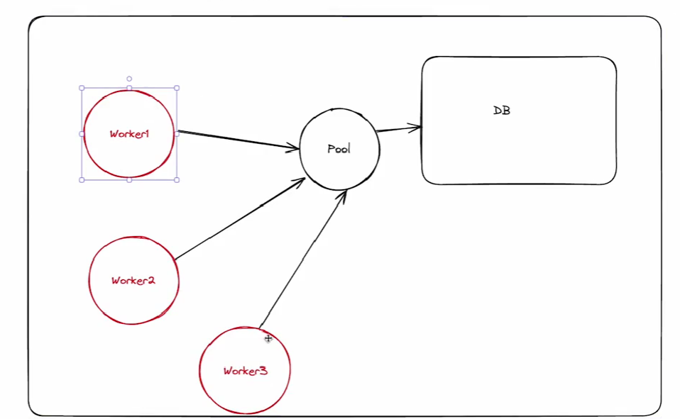

1 Basically this is what pooling means there can be many workers running your backend and those workers may need to connect to you DB and for DB we can have restrictions on the number of workers connecting. So we create a pool of may workers connected and then that pool connects to the DB